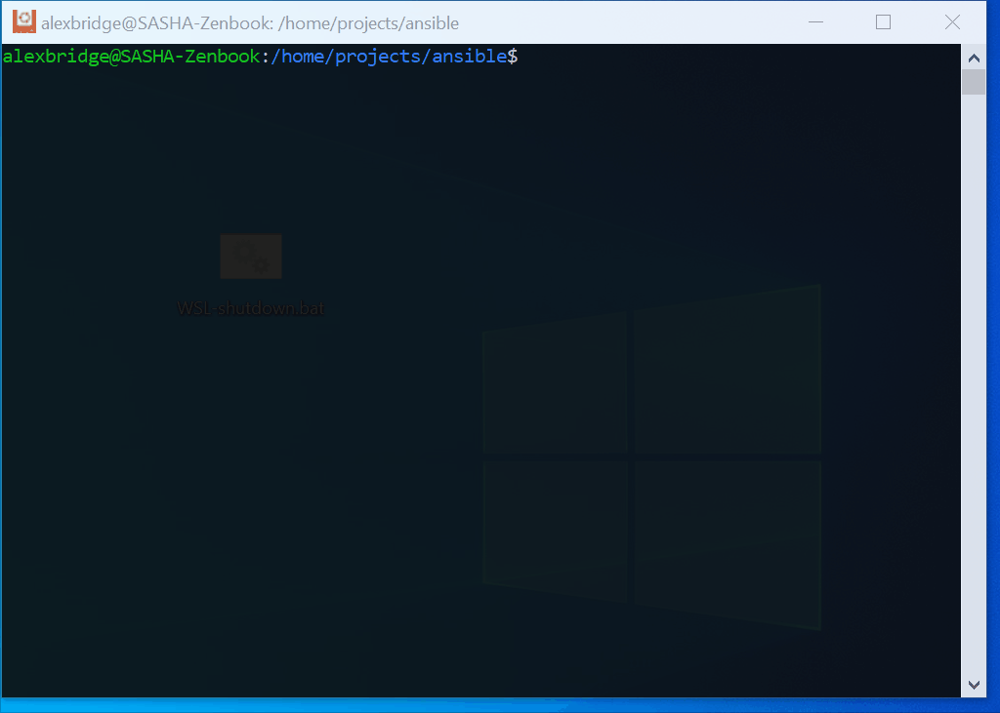

### Ansible playbooks for base VM setup

#### Live example

#### Local testing of playbooks

First create and run ***Ubuntu*** Docker container

- inside `local` directory
- `make init-ubuntu` : this will create local ubuntu VM and local inventory file

Check [local Makefile](./local/Makefile) recipes for local playbook commands

Base VM setup Playbooks:

- `make ping`: to check is key connection works
- `make play-ping`: to check is Ubuntu Container availabe, debug some variables
- `make play-base`: basic VM setup (packages): git, docker, etc.

Project specific VM setup Playbooks:
- `make play-project-nginx`: install nginx and add project hosts
- `make play-project-backend`: deploy project backend
- `make play-project-ssh`: add SSH authorized keys

#### Execute playbooks on remote host

Update [./inventory/remote.ini](./inventory/remote.ini)  

- add remote VM IP address and other configs (if needed)

Run Playbooks
- check [Makefile](./Makefile) recipes for playbook commands

